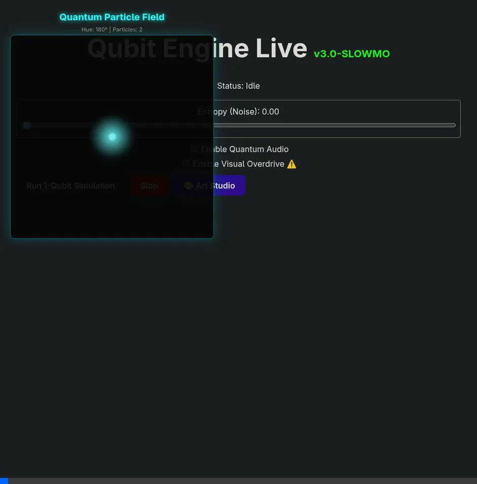

<p align="center">
  
</p>

<h1 align="center">QubitEngine</h1>

<p align="center">
  <strong>⚛️ A Cloud-Native, Distributed Quantum Simulator</strong>
</p>

<p align="center">
  <a href="#quick-start">Quick Start</a> •
  <a href="#features">Features</a> •
  <a href="#architecture">Architecture</a> •
  <a href="#game-engine-api">Game Engine API</a> •
  <a href="#domain-modules">Scientific Modules</a> •
  <a href="#deployment">Deployment</a>
</p>

<p align="center">
  
  
  
  
  
  
</p>

---

## Overview

**QubitEngine** is a high-performance, distributed quantum simulator designed to break the physical RAM limits of local machines. Unlike Python-based simulators, QubitEngine uses a **C++20 Kernel with AVX2 Intrinsics** wrapped in a **Cloud-Native Microservices Mesh**.

It functions as both a rigorous **Physics Platform** (VQE Chemistry) and a **Quantum Logic Processor** for Game Development (True RNG, Entanglement Mechanics).

**Key Capabilities:**
- **Distributed Simulation:** Shards the state vector across Kubernetes nodes via **MPI (Message Passing Interface)** to simulate 34+ qubits.
- **Real-Time Visualization:** WebGPU-accelerated rendering of the Bloch sphere and 30-qubit state vectors at 60 FPS.
- **Game Ready:** Embeddable gRPC modules for "True Randomness" and "Entangled Game States."
- **Production Grade:** Includes job scheduling, Redis caching, and Multi-Cluster Federation.


https://www.youtube.com/watch?v=wHKdeQkz4mo

---

## 🎬 Demo

<p align="center">
  <a href="https://youtu.be/wHKdeQkz4mo">
    
  </a>
</p>

<p align="center">
  <em>Quantum Art Studio — Generating music and visuals from wavefunction collapse in real-time.</em>
</p>

---

## Quick Start

### Prerequisites
- Docker 20.10+
- Docker Compose v2 (Local)
- Kubernetes Cluster (For Distributed Mode)

### One-Command Setup (Local Mode)

```bash
# Clone and start the stack (Single Node Mode)
git clone [https://github.com/perclft/QubitEngine.git](https://github.com/perclft/QubitEngine.git)
cd QubitEngine
docker compose -f deploy/docker/docker-compose.yaml up --build

# Open the dashboard
open http://localhost:5173
